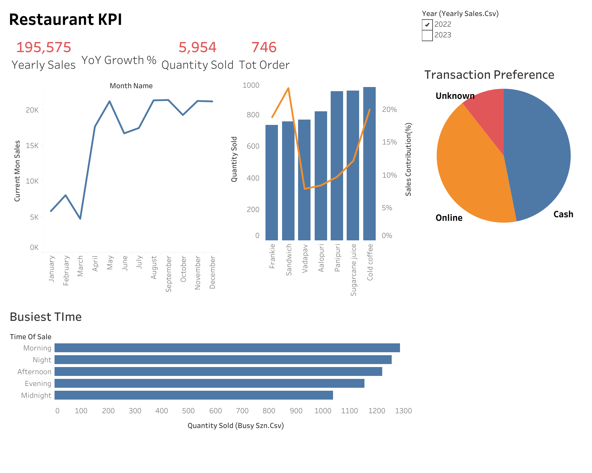
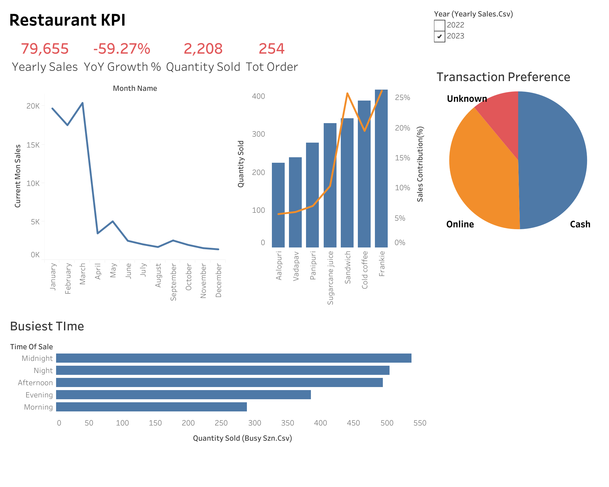

# 🍔 Restaurant Sales Performance Analysis | SQL + Tableau Business Intelligence Case Study

## 📌 Project Overview

This project analyses two years of restaurant sales data using PostgreSQL and Tableau to evaluate business performance, identify revenue-driving products, uncover operational trends, and provide data-driven recommendations to support management decision-making

---

## 🎯 Business Problem

As the restaurant expanded its operations, management required greater visibility into sales performance and operational trends to support data-driven decision-making:

- Is the business growing?
- Which products generate the most revenue?
- When is the restaurant busiest?
- How do customers prefer to pay?
- Which areas require management attention?

---

## 🛠 Tools Used

- PostgreSQL
- Tableau
- GitHub

---

## 📂 Dataset

**Source**

Restaurant Sales Dataset (Kaggle)

**Time Period**

2022–2023

---

### 2022 Dashboard
[]

[]

---

## 📈 Key Insights

### Revenue

Revenue declined by 59.27% year-over-year, representing a material deterioration in business performance that warrants further investigation.

### Product Performance

Sandwiches remained the primary revenue driver across both years, highlighting their importance to the restaurant's overall sales performance.

### Operations

Afternoon and Night consistently recorded the highest quantity sold, indicating greater operational workload during these periods.

### Payment Methods

Customers demonstrated a balanced preference between cash and digital payments, reinforcing the importance of supporting multiple payment options.

## 💡 Recommendations

- Investigate the factors contributing to the revenue decline.
- Optimise staffing allocation during peak operational periods.
- Maintain inventory availability for high-performing products.
- Improve transaction data quality by resolving unknown payment records.

## 🚀 Future Improvements

If more business data were available, future analysis could include:

- Customer segmentation
- Profit margin analysis
- Inventory optimisation
- Sales forecasting
- Customer retention

## 📁 Repository Structure

Restaurant-Sales-Analytics/

├── SQL/

├── Dashboard/

├── Images/

└── README.md

## Skills Demonstrated

- SQL (CASE Functions,CTEs,Window Functions)
- Data Cleaning
- Exploratory Data Analysis
- KPI Development
- Business Intelligence
- Data Visualisation
- Business Storytelling
## Interactive Dashboard

View the interactive Tableau dashboard here:

[Restaurant Sales Dashboard](https://public.tableau.com/app/profile/abdul.muneer/viz/RestaurantSales_3/Dashboard1)

